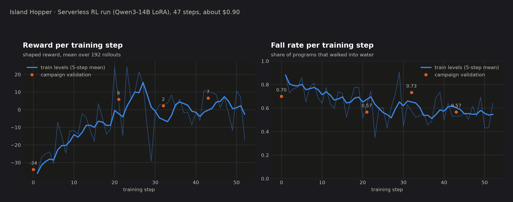

# Island Hopper

A Swift-Playgrounds-style 3D puzzle game that an LLM agent learns to play. Built for the
"Vibe-code, trace, and deploy your agents" What's New Wednesday demo.

A small creature stands on floating tiles. You (or an agent) write a whole program from five
commands and run it. Walk off a tile and you splash. Collect gems, reach the portal.

```
move_forward   turn_left   turn_right   collect_gem   toggle_switch
```

## Quick start: play it yourself

```bash
uv sync --extra dev
uv run pytest -q             # engine + solver + generator tests
uv run island-web            # renderer at http://127.0.0.1:8765, play by hand in the browser
```

No accounts, no keys. Click commands into a program, hit run, watch the creature go.

## Bring your own AI

Any model behind an OpenAI-compatible endpoint can play: Ollama, vLLM, OpenAI, W&B Inference, or a
checkpoint you trained. Put it in `.env` (copy `.env.example`):

```bash
ISLAND_MODEL=qwen3:14b
ISLAND_BASE_URL=http://localhost:11434/v1     # Ollama; or https://api.openai.com/v1 + ISLAND_API_KEY=sk-...
```

Then either watch it in the browser (`uv run island-web`, pick it in the AI dropdown, press play) or run the
campaign from the terminal:

```bash
uv run island-play --levels 1-10                          # your model from .env
uv run island-play --levels 1-10 --model gpt-5-mini --base-url https://api.openai.com/v1
uv run island-play --levels 1-10 --mock sloppy            # no model at all: a scripted policy, still animates
```

**Claude Code can play too.** The MCP server is a separate stdio process, and `.mcp.json` registers it for
Claude Code in this directory, so opening Claude Code here gives it the game as tools:

| tool | what it does |
|---|---|
| `list_levels()` | campaign levels 1..10 |
| `get_level(level_id)` | ASCII map, rules, scoring, attempts left |
| `run_program(level_id, commands, thought)` | run a program, get step-by-step outcome + score |
| `reset_level(level_id)` | forget attempts |
| `get_progress()` | scoreboard |

Every tool call also POSTs an event to the renderer, so the browser animates whatever the agent does. If the
renderer is not running the game still works; events are dropped.

Procedural levels use ids like `gen-3-42` (difficulty 1–5, seed). These are the RL training set; the
hand-built campaign is the held-out test set.

## Optional: trace every game in Weave

Set `WANDB_PROJECT=<your-entity>/island-hopper` in `.env` and log in with `wandb login`. From then on every
game, from the browser, the CLI, or the eval, is traced with [Weave](https://weave-docs.wandb.ai) following its
agent model: conversation = level, turn = attempt, `chat` span = the model writing the program, `execute_tool`
span = `run_program`. Open `https://wandb.ai/<entity>/island-hopper/weave` and use the
[Agents / Conversations](https://weave-docs.wandb.ai/guides/tracking/tracing) views to step through what the
model saw, wrote, and got back on each attempt. This also adds `gpt-oss-20b` on W&B Inference as a baseline
player in the browser. Prompt variants: `--variant baseline|careful|planner`.

## Scoring (single source of truth: `islandgame/engine.py`)

+50 portal, +20 per gem, −2 per command, −30 fall, −20 finished without the portal, −40 invalid/over-long program,
−3 wasted collect/toggle, −15 per extra attempt. Invalid must be worse than falling: an early RL run learned to submit
over-long programs because they scored 0.

## Layout

```
islandgame/engine.py      rules, scoring, ASCII description for the model
islandgame/levels.py      10 hand-built levels + procedural generator (solver-verified)
islandgame/solver.py      optimal-program search; gives a reference score per level
islandgame/mcp_server.py  MCP tools (stdio), pushes events to the renderer
islandgame/web_server.py  FastAPI: serves web/, websocket fan-out, manual-play API
web/index.html            Three.js renderer + program pane
```

## Play with a model (traced in Weave)

```bash
uv run island-play --levels 1-10 --model openai/gpt-oss-20b --tag baseline      # uses WANDB_PROJECT from .env
uv run island-play --levels 1-10 --mock sloppy --no-weave                       # no keys: scripted policy, still animates
```

Every game is traced with [Weave](https://weave-docs.wandb.ai). The layout follows Weave's agent model:
conversation = level, turn = attempt, `chat` span = the model writing the program, `execute_tool` span =
`run_program`. Open your project at `https://wandb.ai/<entity>/island-hopper/weave` and use the
[Agents / Conversations](https://weave-docs.wandb.ai/guides/tracking/tracing) views to step through what the
model saw, wrote, and got back on each attempt. Pass `--project other-entity/other-project` to override `.env`.
Prompt variants: `--variant baseline|careful|planner`. gpt-oss models get `--reasoning-effort low` by default.

## Optional: train your own player (W&B Serverless Training via ART)

Bringing a model is enough to play. If you want to see a model *learn* the game, `train/` runs GRPO-style RL
over the procedural levels on [W&B Serverless Training](https://docs.wandb.ai/guides/training/) through
[ART](https://art.openpipe.ai). Requires `WANDB_PROJECT` in `.env`.

```bash
uv run python train/train_rl.py --steps 1 --groups 4 --rollouts 4 --dry-run    # rollouts only, no training
uv run python train/train_rl.py --steps 40 --groups 16 --rollouts 8 --budget-usd 5 --max-minutes 180
```

Base model `OpenPipe/Qwen3-14B-Instruct`, LoRA trained by Serverless Training (free in preview; you pay
inference at $0.05/$0.22 per M tokens). Procedural levels are the training set with a difficulty curriculum;
the campaign is `val`. The model is registered as `<entity>/island-hopper/<model_name>` (`--model-name`,
default `island-hopper-qwen14b-v5`) and checkpoints auto-deploy. Play any checkpoint through the same player:

```bash
uv run island-play --levels 1-10 --base-url https://api.training.wandb.ai/v1/ \
  --model wandb-artifact:///<entity>/island-hopper/island-hopper-qwen14b-v5        # latest
uv run island-play --levels 1-10 --base-url https://api.training.wandb.ai/v1/ \
  --model wandb-artifact:///<entity>/island-hopper/island-hopper-qwen14b-v5:step1  # a specific checkpoint
```

Set `ISLAND_CHECKPOINT` / `ISLAND_CHECKPOINT_STEP` in `.env` to offer a trained checkpoint as the
"after RL" player in the browser. Training metrics and per-step trajectories land in a W&B run named after the
model in your project; the rollouts themselves are Weave traces in the same project.



## Optional: compare players on the campaign (Weave Evaluation + W&B runs)

```bash
uv run python eval/eval_checkpoint.py --model openai/gpt-oss-20b --name gpt-oss-20b-baseline
uv run python eval/eval_checkpoint.py --model "wandb-artifact:///<entity>/island-hopper/island-hopper-qwen14b-v5:step10" \
    --base-url https://api.training.wandb.ai/v1/ --checkpoint 10 --name qwen14b-v5-step10
```

Each run: config = model, checkpoint, prompt variant, temperature, attempts; summary = levels_solved, total_score,
mean_regret, fall_rate, gem_rate, tokens, cost. Runs are grouped under `campaign-eval`. The run logs the repo as a
code artifact, which is what W&B needs to auto-create a Launch job from it.
